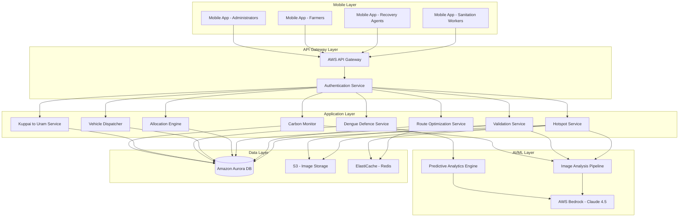

# Design Document: Sutham Waste Management Platform

## Overview

Sutham is a mobile-first, AI-driven waste management platform that transforms waste collection from reactive cleanup to predictive resource management. The system leverages AWS Bedrock with Claude 4.5 for multimodal image analysis, enabling zero-IoT waste monitoring through crowdsourced smartphone imagery.

The platform creates a circular economy ecosystem by connecting five key stakeholder groups:
- Municipal sanitation workers (waste collection)
- Informal recovery agents (recyclable material recovery)
- Farmers (organic waste utilization)
- Municipal administrators (operations management)
- Community health workers (disease prevention)

### Key Design Principles

1. **Mobile-First Architecture**: Optimized for low-bandwidth, intermittent connectivity scenarios common in rural India
2. **AI-Driven Intelligence**: Vision language model(VLM) for waste detection, volume estimation, and health hazard identification
3. **Predictive vs Reactive**: Anticipate health crises and optimize operations before problems escalate
4. **Verification-Based Accountability**: Photo proof of work completion with AI validation
5. **Resource Optimization**: Match vehicle capacity to waste volume, optimize routes for fuel efficiency
6. **Circular Economy Integration**: Connect waste streams to economic opportunities (recycling, composting)

## Architecture

### System Architecture Diagram




### Technology Stack

**Mobile Layer:**
- React Native for cross-platform mobile development (iOS/Android)
- Offline-first architecture with local SQLite database
- React Native Maps for geolocation and mapping
- React Native Camera for image capture
- AsyncStorage for local data persistence

**Backend Services:**
- Node.js with Express for API services
- AWS Lambda for serverless compute (event-driven processing)
- AWS API Gateway for RESTful API management
- AWS Cognito for authentication and user management

**AI/ML Services:**
- AWS Bedrock with Claude 4.5 Sonnet for multimodal image analysis
- Custom prompt engineering for waste detection, volume estimation, and hazard identification
- Amazon SageMaker for predictive analytics (disease outbreak modeling)

**Data Storage:**
- Amazon Aurora PostgreSQL for relational data (hotspots, tasks, users, routes)
- Amazon S3 for image storage with lifecycle policies
- Amazon ElastiCache (Redis) for caching route calculations and frequently accessed data

**Infrastructure:**
- AWS CloudFormation for infrastructure as code
- Amazon CloudWatch for monitoring and logging
- AWS SNS for push notifications
- AWS SES for email notifications

## Components and Interfaces

### 1. Image Analysis Pipeline

**Purpose:** Process smartphone photos to extract waste metadata (type, volume, hazards)

**Interface:**
```typescript
interface ImageAnalysisRequest {
  imageUrl: string;
  imageType: 'before' | 'after' | 'hotspot';
  gpsCoordinates?: {
    latitude: number;
    longitude: number;
    accuracy: number;
  };
  timestamp: Date;
  userId: string;
}

interface ImageAnalysisResponse {
  wasteDetected: boolean;
  wasteTypes: WasteType[];
  estimatedVolume: {
    value: number;
    unit: 'cubic_meters' | 'kilograms';
    confidence: number;
  };
  hazards: {
    stagnantWater: boolean;
    burning: boolean;
    medical: boolean;
    hazardous: boolean;
  };
  recyclables: {
    type: 'PET' | 'metal' | 'electronics' | 'cardboard';
    estimatedValue: number;
  }[];
  confidence: number;
  analysisTimestamp: Date;
}
```

**Implementation Details:**
- Uses AWS Bedrock Claude 4.5 with vision capabilities
- Structured prompt engineering for consistent JSON responses
- Confidence threshold of 70% for automatic processing
- Below 70% confidence triggers manual review queue
- Image preprocessing: compression to <2MB, format standardization to JPEG
- Retry logic: 3 attempts with exponential backoff for API failures

**Prompt Strategy:**
```
Analyze this waste image and provide structured data:
1. Waste presence (yes/no)
2. Waste types (organic, plastic, PET, metal, medical, hazardous, mixed)
3. Estimated volume in cubic meters
4. Health hazards: stagnant water, burning indicators, medical waste
5. Recyclable materials with estimated value
6. Confidence score (0-100)

Return JSON format with all fields.
```

### 2. Hotspot Service

**Purpose:** Manage waste accumulation points with geo-tagging and priority scoring

**Interface:**
```typescript
interface Hotspot {
  id: string;
  location: {
    latitude: number;
    longitude: number;
    address: string;
    landmark?: string;
  };
  wasteVolume: number;
  wasteTypes: WasteType[];
  priority: 'code_red' | 'high' | 'medium' | 'low';
  status: 'pending' | 'assigned' | 'in_progress' | 'completed';
  createdAt: Date;
  updatedAt: Date;
  images: {
    beforePhotos: string[];
    afterPhotos: string[];
  };
  assignedTo?: string;
  sensitiveZone?: {
    zoneId: string;
    zoneName: string;
    distance: number;
  };
}

interface HotspotService {
  createHotspot(imageAnalysis: ImageAnalysisResponse, location: Location): Promise<Hotspot>;
  aggregateNearbyHotspots(location: Location, radius: number): Promise<Hotspot>;
  calculatePriority(hotspot: Hotspot): Priority;
  getHotspotsByArea(bounds: GeoBounds): Promise<Hotspot[]>;
  updateHotspotStatus(id: string, status: Status): Promise<void>;
}
```

**Priority Calculation Algorithm:**
```
Priority Score = (Volume Weight × Waste Volume) 
                + (Type Weight × Hazard Factor) 
                + (Proximity Weight × Sensitive Zone Factor)

Where:
- Volume Weight: 0.3
- Type Weight: 0.4
- Proximity Weight: 0.3

Hazard Factor:
- Medical/Hazardous: 10
- Burning: 8
- Stagnant Water: 7
- Mixed: 5
- Organic: 3
- Recyclable: 2

Sensitive Zone Factor:
- Within 200m: 10 (Auto Code Red)
- 200-500m: 7
- 500-1000m: 4
- >1000m: 1

Priority Levels:
- Code Red: Score ≥ 8 or within sensitive zone
- High: Score 6-7.9
- Medium: Score 4-5.9
- Low: Score < 4
```

**Aggregation Logic:**
- Hotspots within 50 meters are considered the same location
- Volume is summed across all contributing photos
- Waste types are merged (union of all detected types)
- Priority is recalculated after aggregation
- Most recent photo becomes the primary image

### 3. Route Optimization Service

**Purpose:** Generate fuel-efficient collection routes with priority-based ordering

**Interface:**
```typescript
interface RouteRequest {
  workerId: string;
  vehicleType: VehicleType;
  startLocation: Location;
  assignedArea: GeoBounds;
  shiftDuration: number; // minutes
}

interface Route {
  id: string;
  waypoints: Waypoint[];
  totalDistance: number; // kilometers
  estimatedDuration: number; // minutes
  estimatedFuelSaved: number; // liters vs unoptimized
  createdAt: Date;
}

interface Waypoint {
  sequence: number;
  hotspot: Hotspot;
  arrivalTime: Date;
  distanceFromPrevious: number;
  instructions: string;
}

interface RouteOptimizationService {
  generateRoute(request: RouteRequest): Promise<Route>;
  recalculateRoute(routeId: string, newHotspot: Hotspot): Promise<Route>;
  optimizeMultipleRoutes(requests: RouteRequest[]): Promise<Route[]>;
}
```

**Optimization Algorithm:**
- Uses modified Traveling Salesman Problem (TSP) solver
- Constraint: Code Red hotspots must be visited first
- Objective: Minimize total distance while respecting priorities
- Implementation: Greedy nearest-neighbor with 2-opt improvement
- Time complexity: O(n²) for n hotspots
- Real-time recalculation when new Code Red appears

**Algorithm Pseudocode:**
```
function generateOptimizedRoute(hotspots, startLocation, vehicleCapacity):
  // Phase 1: Separate by priority
  codeRedHotspots = filter(hotspots, priority == CODE_RED)
  otherHotspots = filter(hotspots, priority != CODE_RED)
  
  // Phase 2: Optimize Code Red sequence
  codeRedRoute = nearestNeighbor(codeRedHotspots, startLocation)
  
  // Phase 3: Optimize remaining hotspots
  lastCodeRedLocation = codeRedRoute.last() or startLocation
  otherRoute = nearestNeighbor(otherHotspots, lastCodeRedLocation)
  
  // Phase 4: Apply 2-opt improvement
  combinedRoute = codeRedRoute + otherRoute
  improvedRoute = twoOptImprovement(combinedRoute)
  
  // Phase 5: Check capacity constraints
  if totalVolume(improvedRoute) > vehicleCapacity:
    return splitRoute(improvedRoute, vehicleCapacity)
  
  return improvedRoute

function nearestNeighbor(hotspots, start):
  route = [start]
  remaining = hotspots.copy()
  current = start
  
  while remaining.notEmpty():
    nearest = findNearest(current, remaining)
    route.append(nearest)
    remaining.remove(nearest)
    current = nearest
  
  return route

function twoOptImprovement(route):
  improved = true
  while improved:
    improved = false
    for i in range(1, route.length - 2):
      for j in range(i + 1, route.length):
        if swapImproves(route, i, j):
          route = swap(route, i, j)
          improved = true
  return route
```


### 4. Validation Service

**Purpose:** Verify cleanup completion through before/after photo comparison

**Interface:**
```typescript
interface ValidationRequest {
  taskId: string;
  beforePhoto: string;
  afterPhoto: string;
  location: Location;
  workerId: string;
}

interface ValidationResponse {
  validated: boolean;
  cleanupPercentage: number;
  remainingWaste: {
    detected: boolean;
    volume: number;
    types: WasteType[];
  };
  feedback: string;
  requiresRework: boolean;
}

interface ValidationService {
  validateCleanup(request: ValidationRequest): Promise<ValidationResponse>;
  compareImages(before: string, after: string): Promise<ComparisonResult>;
  verifyLocation(claimed: Location, actual: Location): boolean;
}
```

**Validation Logic:**
```
1. Location Verification:
   - Calculate distance between task location and photo GPS
   - Accept if distance ≤ 20 meters
   - Reject if distance > 20 meters

2. Image Comparison:
   - Analyze before photo: extract waste volume and types
   - Analyze after photo: extract remaining waste
   - Calculate cleanup percentage: (before - after) / before × 100
   
3. Acceptance Criteria:
   - Cleanup ≥ 95%: Auto-approve
   - Cleanup 80-94%: Approve with note
   - Cleanup 50-79%: Request rework
   - Cleanup < 50%: Reject, require complete rework
   
4. Failure Handling:
   - 3 rejections: Escalate to manual review
   - Manual review by Municipal Administrator
   - Administrator can override AI decision
```

### 5. Allocation Engine

**Purpose:** Identify and allocate high-value recyclable waste to recovery agents

**Interface:**
```typescript
interface RecyclableAllocation {
  id: string;
  hotspotId: string;
  materials: {
    type: 'PET' | 'metal' | 'electronics' | 'cardboard';
    estimatedWeight: number;
    estimatedValue: number;
  }[];
  totalValue: number;
  location: Location;
  status: 'available' | 'allocated' | 'collected';
  allocatedTo?: string;
  createdAt: Date;
}

interface AllocationEngine {
  analyzeRecyclables(imageAnalysis: ImageAnalysisResponse): Promise<RecyclableAllocation>;
  notifyRecoveryAgents(allocation: RecyclableAllocation): Promise<void>;
  selectAgent(allocation: RecyclableAllocation, agents: RecoveryAgent[]): RecoveryAgent;
  recordCollection(allocationId: string, actualMaterials: Material[]): Promise<void>;
}
```

**Material Value Estimation:**
```
Market Rates (per kg):
- PET bottles: ₹15-20
- Aluminum cans: ₹80-100
- Copper wire: ₹400-500
- Electronics: ₹50-200 (varies by type)
- Cardboard: ₹8-12
- Mixed plastic: ₹5-10

Notification Threshold: ₹50 minimum value

Agent Selection Algorithm:
1. Filter agents within 5km radius
2. Sort by:
   - Distance (weight: 0.4)
   - Collection success rate (weight: 0.3)
   - Response time history (weight: 0.3)
3. Notify top 3 agents
4. First to accept gets allocation
5. If no response in 30 minutes, notify next batch
```

### 6. Vehicle Dispatcher

**Purpose:** Match waste volume to appropriate vehicle capacity

**Interface:**
```typescript
interface VehicleType {
  id: string;
  name: string;
  capacity: number; // cubic meters
  fuelEfficiency: number; // km per liter
  costPerKm: number;
  specializations: ('hazardous' | 'medical' | 'general')[];
}

interface DispatchRecommendation {
  vehicleType: VehicleType;
  reason: string;
  utilizationPercentage: number;
  alternativeOptions: VehicleType[];
}

interface VehicleDispatcher {
  recommendVehicle(route: Route): Promise<DispatchRecommendation>;
  splitRoute(route: Route, vehicleCapacity: number): Promise<Route[]>;
  calculateUtilization(route: Route, vehicle: VehicleType): number;
}
```

**Vehicle Types:**
```
1. E-Rickshaw:
   - Capacity: 0.5 cubic meters
   - Fuel: Electric (₹2 per km equivalent)
   - Best for: Small hotspots, narrow lanes
   
2. Small Pickup:
   - Capacity: 3 cubic meters
   - Fuel: Diesel (₹5 per km)
   - Best for: Medium routes, mixed waste
   
3. Compactor Truck:
   - Capacity: 10 cubic meters
   - Fuel: Diesel (₹12 per km)
   - Best for: Large volumes, main roads
   
4. Specialized Vehicle:
   - Capacity: 2 cubic meters
   - Fuel: Diesel (₹8 per km)
   - Required for: Medical, hazardous waste
```

**Dispatch Logic:**
```
function recommendVehicle(route):
  totalVolume = sum(hotspot.volume for hotspot in route.waypoints)
  wasteTypes = union(hotspot.types for hotspot in route.waypoints)
  
  // Check for specialized requirements
  if 'medical' in wasteTypes or 'hazardous' in wasteTypes:
    return SpecializedVehicle
  
  // Match capacity
  if totalVolume <= 0.5:
    return ERickshaw
  else if totalVolume <= 3:
    return SmallPickup
  else if totalVolume <= 10:
    return CompactorTruck
  else:
    // Split route
    return splitRoute(route, CompactorTruck.capacity)
  
function splitRoute(route, maxCapacity):
  subRoutes = []
  currentRoute = []
  currentVolume = 0
  
  for waypoint in route.waypoints:
    if currentVolume + waypoint.volume > maxCapacity:
      subRoutes.append(currentRoute)
      currentRoute = [waypoint]
      currentVolume = waypoint.volume
    else:
      currentRoute.append(waypoint)
      currentVolume += waypoint.volume
  
  if currentRoute.notEmpty():
    subRoutes.append(currentRoute)
  
  return subRoutes
```

### 7. Dengue Defence Service

**Purpose:** Predict disease outbreaks through stagnant water detection and pattern analysis

**Interface:**
```typescript
interface StagnantWaterDetection {
  location: Location;
  surfaceArea: number; // square meters
  containerType: 'tire' | 'bucket' | 'puddle' | 'tank' | 'other';
  detectedAt: Date;
  imageUrl: string;
}

interface OutbreakPrediction {
  id: string;
  area: GeoBounds;
  riskLevel: 'critical' | 'high' | 'moderate' | 'low';
  predictedDate: Date; // 7-10 days from now
  affectedPopulation: number;
  stagnantWaterSites: number;
  recommendations: string[];
  confidence: number;
}

interface DengueDefenceService {
  detectStagnantWater(imageAnalysis: ImageAnalysisResponse): Promise<StagnantWaterDetection>;
  calculateRiskScore(area: GeoBounds): Promise<number>;
  generatePrediction(area: GeoBounds): Promise<OutbreakPrediction>;
  updateRiskAssessment(area: GeoBounds, cleanupActivity: CleanupActivity): Promise<void>;
}
```

**Prediction Model:**
```
Risk Score Calculation:
  Risk = (Water Site Density × 0.4) 
       + (Historical Outbreak Correlation × 0.3)
       + (Seasonal Factor × 0.2)
       + (Population Density × 0.1)

Water Site Density:
  - Count stagnant water sites in 1km² grid
  - Normalize by area: sites per km²
  - Threshold: >5 sites/km² = high risk

Historical Correlation:
  - Match current patterns to past outbreak data
  - Use 3-year historical window
  - Weight recent years higher (exponential decay)

Seasonal Factor:
  - Monsoon season (June-September): 1.5x multiplier
  - Post-monsoon (October-November): 1.3x multiplier
  - Summer (March-May): 1.2x multiplier
  - Winter (December-February): 0.8x multiplier

Population Density:
  - High density (>10,000/km²): 1.3x multiplier
  - Medium density (5,000-10,000/km²): 1.0x multiplier
  - Low density (<5,000/km²): 0.7x multiplier

Risk Levels:
  - Critical: Score ≥ 8 (immediate intervention)
  - High: Score 6-7.9 (7-day warning)
  - Moderate: Score 4-5.9 (10-day warning)
  - Low: Score < 4 (monitoring only)

Prediction Timeline:
  - Critical: 3-5 days advance warning
  - High: 7-10 days advance warning
  - Moderate: 10-14 days advance warning
```

**Real-Time Risk Update:**
```
function updateRiskAssessment(area, cleanupActivity):
  // Recalculate water site density after cleanup
  remainingSites = countStagnantWater(area) - cleanupActivity.sitesCleared
  newDensity = remainingSites / area.size
  
  // Adjust risk score
  oldRisk = getCurrentRisk(area)
  reductionFactor = cleanupActivity.sitesCleared / oldRisk.totalSites
  newRisk = oldRisk.score × (1 - reductionFactor × 0.7)
  
  // Update prediction
  if newRisk < CRITICAL_THRESHOLD:
    downgradeAlert(area)
  
  return newRisk
```

### 8. Kuppai to Uram Service

**Purpose:** Track organic waste composting and notify farmers when ready

**Interface:**
```typescript
interface CompostPit {
  id: string;
  location: Location;
  panchayat: string;
  capacity: number; // cubic meters
  currentVolume: number;
  deposits: CompostDeposit[];
  estimatedReadyDate: Date;
  status: 'filling' | 'composting' | 'ready' | 'depleted';
}

interface CompostDeposit {
  date: Date;
  volume: number;
  wasteTypes: WasteType[];
  estimatedCompostYield: number; // kg
}

interface CompostCollection {
  id: string;
  pitId: string;
  farmerId: string;
  quantityCollected: number; // kg
  collectionDate: Date;
  qualityRating?: number; // 1-5 stars
  feedback?: string;
}

interface KuppaiToUramService {
  recordDeposit(pitId: string, organicWaste: number): Promise<CompostDeposit>;
  estimateCompostionTime(deposit: CompostDeposit): number; // days
  checkCompostReadiness(pitId: string): Promise<boolean>;
  notifyFarmers(pitId: string): Promise<void>;
  recordCollection(collection: CompostCollection): Promise<void>;
}
```

**Composting Timeline:**
```
Composting Duration: 60-90 days (varies by conditions)

Factors Affecting Duration:
1. Temperature:
   - Hot season (>30°C): 60-70 days
   - Moderate (20-30°C): 70-80 days
   - Cool (<20°C): 80-90 days

2. Moisture:
   - Optimal (50-60%): Standard duration
   - Too dry (<40%): +10 days
   - Too wet (>70%): +15 days

3. Turning frequency:
   - Weekly turning: -10 days
   - Bi-weekly: Standard
   - Monthly: +10 days

4. Carbon:Nitrogen ratio:
   - Optimal (25-30:1): Standard
   - High carbon: +15 days
   - High nitrogen: +5 days

Readiness Indicators:
- Dark brown/black color
- Earthy smell (no ammonia)
- Crumbly texture
- Temperature dropped to ambient
- No visible food scraps

Estimated Yield:
  Compost = Organic Waste × 0.3 to 0.4
  (30-40% of input becomes finished compost)
```

**Farmer Notification Logic:**
```
function notifyFarmers(pit):
  if pit.status == 'ready':
    farmers = getFarmersInPanchayat(pit.panchayat)
    availableCompost = pit.currentVolume
    
    // Prioritize by registration date and collection history
    prioritizedFarmers = sortFarmers(farmers, criteria=[
      'registrationDate',
      'collectionFrequency',
      'qualityFeedback'
    ])
    
    // Send notifications
    for farmer in prioritizedFarmers:
      sendNotification(farmer, {
        message: "Compost ready at {pit.location}",
        quantity: availableCompost,
        collectBy: pit.estimatedReadyDate + 30 days
      })
    
    // Seasonal alerts
    if isPlantingSeason():
      sendUrgentAlert(prioritizedFarmers, "Planting season - collect compost now!")
```


### 9. Carbon Monitor Service

**Purpose:** Detect and prevent illegal waste burning to reduce carbon emissions

**Interface:**
```typescript
interface BurningDetection {
  location: Location;
  severity: 'active_fire' | 'smoke' | 'recent_burn' | 'char_marks';
  estimatedArea: number; // square meters
  detectedAt: Date;
  imageUrl: string;
  repeatViolation: boolean;
  violationCount: number;
}

interface CarbonImpactReport {
  period: DateRange;
  burningIncidents: number;
  interventions: number;
  estimatedCO2Prevented: number; // kg
  repeatViolationSites: Location[];
  seasonalTrends: SeasonalData[];
}

interface CarbonMonitorService {
  detectBurning(imageAnalysis: ImageAnalysisResponse): Promise<BurningDetection>;
  createBurningAlert(detection: BurningDetection): Promise<Alert>;
  trackRepeatViolations(location: Location): Promise<ViolationHistory>;
  calculateCarbonImpact(period: DateRange): Promise<CarbonImpactReport>;
  predictHighRiskPeriods(area: GeoBounds): Promise<RiskPeriod[]>;
}
```

**Burning Detection Criteria:**
```
Visual Indicators:
1. Active Fire:
   - Visible flames
   - Bright orange/red glow
   - Immediate Code Red alert

2. Smoke:
   - Gray/black smoke plumes
   - Rising smoke patterns
   - High priority alert

3. Recent Burn:
   - Ash piles
   - Blackened ground
   - Charred materials
   - Medium priority alert

4. Char Marks:
   - Burn scars on ground
   - Discolored vegetation
   - Historical burning site
   - Low priority (monitoring)

AI Detection Confidence:
- Active fire: >90% confidence required
- Smoke: >80% confidence required
- Recent burn: >70% confidence required
- Char marks: >60% confidence required
```

**Carbon Emission Estimation:**
```
Emission Factors (kg CO2 per kg waste):
- Plastic: 3.0 kg CO2/kg
- Paper/Cardboard: 1.5 kg CO2/kg
- Organic: 0.8 kg CO2/kg
- Mixed waste: 2.0 kg CO2/kg (average)

Calculation:
  Estimated CO2 = Waste Volume × Density × Emission Factor
  
  Where:
  - Volume: From image analysis (cubic meters)
  - Density: 150 kg/m³ (average mixed waste)
  - Emission Factor: Based on waste type

Prevention Impact:
  CO2 Prevented = Σ(Burning Incidents Stopped × Estimated CO2)
  
Monthly Report Metrics:
- Total incidents detected
- Interventions completed
- CO2 prevented (kg)
- Repeat violation sites
- Seasonal patterns
```

**Seasonal Risk Prediction:**
```
High-Risk Periods:
1. Post-harvest season (crop residue burning)
   - October-November in North India
   - Risk multiplier: 2.5x

2. Dry summer months
   - March-May
   - Risk multiplier: 1.8x

3. Festival cleanup periods
   - Post-Diwali, Holi
   - Risk multiplier: 1.5x

Proactive Alerts:
- 7 days before high-risk period
- Notify Municipal Administrators
- Increase monitoring frequency
- Deploy additional resources
```

## Data Models

### Core Entities

**User:**
```typescript
interface User {
  id: string;
  name: string;
  phone: string;
  email?: string;
  role: 'sanitation_worker' | 'recovery_agent' | 'farmer' | 'administrator' | 'health_worker';
  assignedArea?: GeoBounds;
  panchayat?: string;
  status: 'active' | 'inactive' | 'suspended';
  createdAt: Date;
  lastActive: Date;
  performanceMetrics?: {
    tasksCompleted: number;
    averageResponseTime: number; // minutes
    validationSuccessRate: number; // percentage
    rating: number; // 1-5 stars
  };
}
```

**Hotspot:**
```typescript
interface Hotspot {
  id: string;
  location: {
    latitude: number;
    longitude: number;
    address: string;
    landmark?: string;
  };
  wasteVolume: number; // cubic meters
  wasteTypes: WasteType[];
  priority: 'code_red' | 'high' | 'medium' | 'low';
  priorityScore: number;
  status: 'pending' | 'assigned' | 'in_progress' | 'completed' | 'verified';
  createdAt: Date;
  updatedAt: Date;
  completedAt?: Date;
  images: {
    beforePhotos: ImageMetadata[];
    afterPhotos: ImageMetadata[];
  };
  assignedTo?: string; // User ID
  sensitiveZone?: {
    zoneId: string;
    zoneName: string;
    distance: number; // meters
  };
  aggregatedFrom?: string[]; // Other hotspot IDs
  validationAttempts: number;
  aiAnalysis: ImageAnalysisResponse[];
}
```

**Task:**
```typescript
interface Task {
  id: string;
  hotspotId: string;
  assignedTo: string; // User ID
  routeId?: string;
  status: 'assigned' | 'accepted' | 'in_progress' | 'completed' | 'verified' | 'rejected';
  priority: 'code_red' | 'high' | 'medium' | 'low';
  createdAt: Date;
  acceptedAt?: Date;
  startedAt?: Date;
  completedAt?: Date;
  verifiedAt?: Date;
  estimatedDuration: number; // minutes
  actualDuration?: number; // minutes
  validationResult?: ValidationResponse;
  rejectionReason?: string;
  escalated: boolean;
}
```

**Route:**
```typescript
interface Route {
  id: string;
  workerId: string;
  vehicleType: VehicleType;
  status: 'planned' | 'active' | 'completed' | 'cancelled';
  waypoints: Waypoint[];
  totalDistance: number; // kilometers
  estimatedDuration: number; // minutes
  actualDuration?: number; // minutes
  estimatedFuelCost: number; // rupees
  actualFuelCost?: number; // rupees
  fuelSaved: number; // liters vs unoptimized
  createdAt: Date;
  startedAt?: Date;
  completedAt?: Date;
  recalculationCount: number;
}
```

**SensitiveZone:**
```typescript
interface SensitiveZone {
  id: string;
  name: string;
  type: 'school' | 'hospital' | 'community_center' | 'religious_site' | 'market';
  location: Location;
  radius: number; // meters (default 200)
  priority: number; // 1-10, affects hotspot priority
  activeHours?: {
    start: string; // HH:MM
    end: string; // HH:MM
  };
  createdBy: string; // Administrator ID
  createdAt: Date;
}
```

**RecyclableAllocation:**
```typescript
interface RecyclableAllocation {
  id: string;
  hotspotId: string;
  materials: {
    type: 'PET' | 'metal' | 'electronics' | 'cardboard' | 'glass';
    estimatedWeight: number; // kg
    estimatedValue: number; // rupees
  }[];
  totalValue: number; // rupees
  location: Location;
  status: 'available' | 'notified' | 'allocated' | 'collected' | 'expired';
  notifiedAgents: string[]; // Recovery Agent IDs
  allocatedTo?: string; // Recovery Agent ID
  allocatedAt?: Date;
  collectedAt?: Date;
  actualMaterials?: {
    type: string;
    weight: number;
    value: number;
  }[];
  createdAt: Date;
  expiresAt: Date; // 24 hours from creation
}
```

**CompostPit:**
```typescript
interface CompostPit {
  id: string;
  name: string;
  location: Location;
  panchayat: string;
  capacity: number; // cubic meters
  currentVolume: number; // cubic meters
  availableCompost: number; // kg
  status: 'filling' | 'composting' | 'ready' | 'depleted';
  deposits: CompostDeposit[];
  collections: CompostCollection[];
  estimatedReadyDate?: Date;
  lastTurnedDate?: Date;
  temperatureReadings?: TemperatureReading[];
  createdAt: Date;
  updatedAt: Date;
}
```

**OutbreakPrediction:**
```typescript
interface OutbreakPrediction {
  id: string;
  area: GeoBounds;
  riskLevel: 'critical' | 'high' | 'moderate' | 'low';
  riskScore: number;
  predictedDate: Date;
  predictionWindow: {
    earliest: Date;
    latest: Date;
  };
  affectedPopulation: number;
  stagnantWaterSites: StagnantWaterDetection[];
  historicalCorrelation: number; // 0-1
  seasonalFactor: number;
  recommendations: string[];
  confidence: number; // 0-100
  status: 'active' | 'monitoring' | 'resolved' | 'escalated';
  createdAt: Date;
  updatedAt: Date;
  resolvedAt?: Date;
  interventions: Intervention[];
}
```

**BurningIncident:**
```typescript
interface BurningIncident {
  id: string;
  location: Location;
  severity: 'active_fire' | 'smoke' | 'recent_burn' | 'char_marks';
  estimatedArea: number; // square meters
  estimatedWasteVolume: number; // cubic meters
  estimatedCO2: number; // kg
  detectedAt: Date;
  imageUrl: string;
  status: 'detected' | 'alerted' | 'responded' | 'resolved' | 'false_positive';
  repeatViolation: boolean;
  violationCount: number;
  respondedAt?: Date;
  resolvedAt?: Date;
  responseTime?: number; // minutes
  aiConfidence: number;
}
```

### Database Schema

**PostgreSQL Tables:**

```sql
-- Users table
CREATE TABLE users (
  id UUID PRIMARY KEY DEFAULT gen_random_uuid(),
  name VARCHAR(255) NOT NULL,
  phone VARCHAR(20) UNIQUE NOT NULL,
  email VARCHAR(255),
  role VARCHAR(50) NOT NULL,
  assigned_area JSONB,
  panchayat VARCHAR(255),
  status VARCHAR(20) DEFAULT 'active',
  performance_metrics JSONB,
  created_at TIMESTAMP DEFAULT NOW(),
  last_active TIMESTAMP DEFAULT NOW()
);

-- Hotspots table
CREATE TABLE hotspots (
  id UUID PRIMARY KEY DEFAULT gen_random_uuid(),
  location GEOGRAPHY(POINT, 4326) NOT NULL,
  address TEXT,
  landmark VARCHAR(255),
  waste_volume DECIMAL(10, 2),
  waste_types TEXT[],
  priority VARCHAR(20),
  priority_score DECIMAL(5, 2),
  status VARCHAR(20) DEFAULT 'pending',
  created_at TIMESTAMP DEFAULT NOW(),
  updated_at TIMESTAMP DEFAULT NOW(),
  completed_at TIMESTAMP,
  images JSONB,
  assigned_to UUID REFERENCES users(id),
  sensitive_zone JSONB,
  aggregated_from UUID[],
  validation_attempts INTEGER DEFAULT 0,
  ai_analysis JSONB[]
);

-- Create spatial index for location queries
CREATE INDEX idx_hotspots_location ON hotspots USING GIST(location);
CREATE INDEX idx_hotspots_status ON hotspots(status);
CREATE INDEX idx_hotspots_priority ON hotspots(priority);

-- Tasks table
CREATE TABLE tasks (
  id UUID PRIMARY KEY DEFAULT gen_random_uuid(),
  hotspot_id UUID REFERENCES hotspots(id),
  assigned_to UUID REFERENCES users(id),
  route_id UUID,
  status VARCHAR(20) DEFAULT 'assigned',
  priority VARCHAR(20),
  created_at TIMESTAMP DEFAULT NOW(),
  accepted_at TIMESTAMP,
  started_at TIMESTAMP,
  completed_at TIMESTAMP,
  verified_at TIMESTAMP,
  estimated_duration INTEGER,
  actual_duration INTEGER,
  validation_result JSONB,
  rejection_reason TEXT,
  escalated BOOLEAN DEFAULT FALSE
);

-- Routes table
CREATE TABLE routes (
  id UUID PRIMARY KEY DEFAULT gen_random_uuid(),
  worker_id UUID REFERENCES users(id),
  vehicle_type VARCHAR(50),
  status VARCHAR(20) DEFAULT 'planned',
  waypoints JSONB[],
  total_distance DECIMAL(10, 2),
  estimated_duration INTEGER,
  actual_duration INTEGER,
  estimated_fuel_cost DECIMAL(10, 2),
  actual_fuel_cost DECIMAL(10, 2),
  fuel_saved DECIMAL(10, 2),
  created_at TIMESTAMP DEFAULT NOW(),
  started_at TIMESTAMP,
  completed_at TIMESTAMP,
  recalculation_count INTEGER DEFAULT 0
);

-- Sensitive zones table
CREATE TABLE sensitive_zones (
  id UUID PRIMARY KEY DEFAULT gen_random_uuid(),
  name VARCHAR(255) NOT NULL,
  type VARCHAR(50),
  location GEOGRAPHY(POINT, 4326) NOT NULL,
  radius INTEGER DEFAULT 200,
  priority INTEGER,
  active_hours JSONB,
  created_by UUID REFERENCES users(id),
  created_at TIMESTAMP DEFAULT NOW()
);

CREATE INDEX idx_sensitive_zones_location ON sensitive_zones USING GIST(location);

-- Recyclable allocations table
CREATE TABLE recyclable_allocations (
  id UUID PRIMARY KEY DEFAULT gen_random_uuid(),
  hotspot_id UUID REFERENCES hotspots(id),
  materials JSONB[],
  total_value DECIMAL(10, 2),
  location GEOGRAPHY(POINT, 4326),
  status VARCHAR(20) DEFAULT 'available',
  notified_agents UUID[],
  allocated_to UUID REFERENCES users(id),
  allocated_at TIMESTAMP,
  collected_at TIMESTAMP,
  actual_materials JSONB,
  created_at TIMESTAMP DEFAULT NOW(),
  expires_at TIMESTAMP
);

-- Compost pits table
CREATE TABLE compost_pits (
  id UUID PRIMARY KEY DEFAULT gen_random_uuid(),
  name VARCHAR(255) NOT NULL,
  location GEOGRAPHY(POINT, 4326) NOT NULL,
  panchayat VARCHAR(255),
  capacity DECIMAL(10, 2),
  current_volume DECIMAL(10, 2),
  available_compost DECIMAL(10, 2),
  status VARCHAR(20) DEFAULT 'filling',
  deposits JSONB[],
  collections JSONB[],
  estimated_ready_date DATE,
  last_turned_date DATE,
  temperature_readings JSONB[],
  created_at TIMESTAMP DEFAULT NOW(),
  updated_at TIMESTAMP DEFAULT NOW()
);

-- Outbreak predictions table
CREATE TABLE outbreak_predictions (
  id UUID PRIMARY KEY DEFAULT gen_random_uuid(),
  area JSONB NOT NULL,
  risk_level VARCHAR(20),
  risk_score DECIMAL(5, 2),
  predicted_date DATE,
  prediction_window JSONB,
  affected_population INTEGER,
  stagnant_water_sites JSONB[],
  historical_correlation DECIMAL(3, 2),
  seasonal_factor DECIMAL(3, 2),
  recommendations TEXT[],
  confidence INTEGER,
  status VARCHAR(20) DEFAULT 'active',
  created_at TIMESTAMP DEFAULT NOW(),
  updated_at TIMESTAMP DEFAULT NOW(),
  resolved_at TIMESTAMP,
  interventions JSONB[]
);

-- Burning incidents table
CREATE TABLE burning_incidents (
  id UUID PRIMARY KEY DEFAULT gen_random_uuid(),
  location GEOGRAPHY(POINT, 4326) NOT NULL,
  severity VARCHAR(20),
  estimated_area DECIMAL(10, 2),
  estimated_waste_volume DECIMAL(10, 2),
  estimated_co2 DECIMAL(10, 2),
  detected_at TIMESTAMP DEFAULT NOW(),
  image_url TEXT,
  status VARCHAR(20) DEFAULT 'detected',
  repeat_violation BOOLEAN DEFAULT FALSE,
  violation_count INTEGER DEFAULT 1,
  responded_at TIMESTAMP,
  resolved_at TIMESTAMP,
  response_time INTEGER,
  ai_confidence INTEGER
);

CREATE INDEX idx_burning_incidents_location ON burning_incidents USING GIST(location);
```


## Correctness Properties

*A property is a characteristic or behavior that should hold true across all valid executions of a system—essentially, a formal statement about what the system should do. Properties serve as the bridge between human-readable specifications and machine-verifiable correctness guarantees.*

### Image Analysis Properties

**Property 1: Waste Detection Consistency**
*For any* image submitted to the platform, the AI analysis should return a boolean waste detection result with a confidence score between 0 and 100.
**Validates: Requirements 1.1**

**Property 2: Volume Estimation Bounds**
*For any* image where waste is detected, the estimated volume should be a positive number with an associated confidence score, and volumes should be within reasonable bounds (0.01 to 50 cubic meters for typical waste accumulations).
**Validates: Requirements 1.2**

**Property 3: Waste Type Classification Completeness**
*For any* image where waste is detected, the classification should return at least one waste type from the defined categories (organic, plastic, PET, metal, medical, hazardous, mixed).
**Validates: Requirements 1.3**

**Property 4: GPS Extraction from Metadata**
*For any* image with GPS EXIF metadata, the platform should successfully extract latitude and longitude coordinates and create a geo-tagged hotspot.
**Validates: Requirements 1.4**

**Property 5: Manual Location Prompt for Missing GPS**
*For any* image without GPS metadata, the platform should trigger a manual location selection interface before creating a hotspot.
**Validates: Requirements 1.5**

### Hotspot Management Properties

**Property 6: Hotspot Aggregation by Proximity**
*For any* set of photos submitted within 50 meters of each other, the platform should aggregate them into a single hotspot with combined volume estimates rather than creating multiple separate hotspots.
**Validates: Requirements 1.6**

**Property 7: Priority Score Calculation**
*For any* hotspot created, the priority score should be calculated using the formula: (Volume Weight × Waste Volume) + (Type Weight × Hazard Factor) + (Proximity Weight × Sensitive Zone Factor), and the score should determine the priority level (Code Red, High, Medium, Low).
**Validates: Requirements 1.7**

**Property 8: Automatic Code Red Elevation for Sensitive Zones**
*For any* hotspot located within 200 meters of a sensitive zone, the platform should automatically assign Code Red priority regardless of other factors.
**Validates: Requirements 1.8, 3.2**

### Route Optimization Properties

**Property 9: Route Generation from Pending Hotspots**
*For any* sanitation worker starting a shift with pending hotspots in their assigned area, the platform should generate a route containing all pending hotspots.
**Validates: Requirements 2.1**

**Property 10: Distance Optimization**
*For any* generated route, the total distance should be less than or equal to a naive sequential visit of the same hotspots, demonstrating optimization.
**Validates: Requirements 2.2**

**Property 11: Code Red Priority Ordering**
*For any* route containing both Code Red and non-Code Red hotspots, all Code Red hotspots should appear before any non-Code Red hotspots in the waypoint sequence.
**Validates: Requirements 2.3**

**Property 12: Dynamic Route Recalculation**
*For any* active route, when a new Code Red hotspot is created in the assigned area, the platform should recalculate the route to include the new hotspot and notify the worker within 30 seconds.
**Validates: Requirements 2.4, 2.5**

**Property 13: Fuel Efficiency Metrics**
*For any* completed route, the platform should calculate and display fuel efficiency metrics comparing actual distance to an unoptimized baseline.
**Validates: Requirements 2.6**

**Property 14: Traffic-Aware Routing**
*For any* route calculation when traffic or road closure data is available, the generated route should avoid blocked roads and incorporate traffic conditions.
**Validates: Requirements 2.7**

### Sensitive Zone Management Properties

**Property 15: Geofence Creation**
*For any* sensitive zone defined by an administrator, the platform should create a geofence with the specified radius (default 200 meters) around the location.
**Validates: Requirements 3.1**

**Property 16: Code Red Notification Broadcast**
*For any* Code Red task created, the platform should send push notifications to all available sanitation workers in the area within 30 seconds.
**Validates: Requirements 3.3**

**Property 17: Code Red Task Ranking by Vulnerability**
*For any* set of multiple Code Red tasks, the platform should rank them with schools having higher priority than hospitals, which have higher priority than other sensitive zones.
**Validates: Requirements 3.4**

**Property 18: Unassigned Task Escalation**
*For any* Code Red task that remains unassigned, if 30 minutes elapse from creation, the platform should escalate the alert to municipal administrator level.
**Validates: Requirements 3.5**

**Property 19: Navigation Provision on Acceptance**
*For any* Code Red task accepted by a sanitation worker, the platform should immediately provide turn-by-turn navigation to the hotspot location.
**Validates: Requirements 3.6**

**Property 20: Response Time Logging**
*For any* Code Red task that is completed, the platform should log the response time calculated as the duration from task creation to completion.
**Validates: Requirements 3.7**

### Dengue Defence Properties

**Property 21: Stagnant Water Detection**
*For any* image analyzed by the platform, the Dengue Defence service should identify the presence of stagnant water in containers, tires, puddles, or tanks.
**Validates: Requirements 4.1, 13.4**

**Property 22: Stagnant Water Logging and Area Calculation**
*For any* image where stagnant water is detected, the platform should log the location and calculate the surface area of the standing water.
**Validates: Requirements 4.2**

**Property 23: Outbreak Prediction Threshold**
*For any* 1-kilometer square area, when the density of stagnant water sites exceeds 5 sites per km², the Dengue Defence should generate a disease outbreak prediction.
**Validates: Requirements 4.3**

**Property 24: Prediction Timeline Window**
*For any* disease outbreak prediction generated, the prediction should include a warning timeline of 7-10 days in advance based on the risk level.
**Validates: Requirements 4.4**

**Property 25: Health Worker Notification**
*For any* disease outbreak prediction issued, the platform should notify all community health workers and municipal administrators in the affected area.
**Validates: Requirements 4.5**

**Property 26: Historical Correlation**
*For any* area with available historical disease data, the Dengue Defence should incorporate past outbreak patterns to improve prediction accuracy.
**Validates: Requirements 4.6**

**Property 27: Seasonal Monitoring Adjustment**
*For any* area during monsoon season (June-September), the Dengue Defence should increase monitoring frequency and apply a 1.5x risk multiplier.
**Validates: Requirements 4.7**

**Property 28: Real-Time Risk Update**
*For any* predicted outbreak area, when cleanup activity removes stagnant water sites, the Dengue Defence should recalculate and update the risk assessment in real-time.
**Validates: Requirements 4.8**

### Validation System Properties

**Property 29: Before Photo Requirement**
*For any* task assigned to a sanitation worker, the platform should enforce a before photo requirement at the hotspot location before allowing task progression.
**Validates: Requirements 5.1**

**Property 30: Location Verification**
*For any* photo submitted for a task, the platform should verify that the GPS coordinates are within 20 meters of the hotspot location, rejecting photos taken from farther away.
**Validates: Requirements 5.2**

**Property 31: After Photo Requirement**
*For any* task completion attempt, the platform should require an after photo from the hotspot location before allowing the task to be marked as complete.
**Validates: Requirements 5.3**

**Property 32: AI Cleanup Verification**
*For any* before/after photo pair, the AI should analyze both images and calculate a cleanup percentage, accepting completion only if cleanup is ≥80%.
**Validates: Requirements 5.4, 5.5, 5.6, 13.6**

**Property 33: Task Completion Time Tracking**
*For any* task that is completed, the platform should calculate and record the elapsed time from task assignment to completion.
**Validates: Requirements 5.7**

**Property 34: Three-Strike Escalation**
*For any* task where validation fails three times, the platform should escalate the task to a municipal administrator for manual review.
**Validates: Requirements 5.8**

### Allocation Engine Properties

**Property 35: Recyclable Material Identification**
*For any* waste image analyzed, the Allocation Engine should identify high-value recyclable materials (PET, metal, electronics, cardboard) and estimate their weight.
**Validates: Requirements 6.1**

**Property 36: Recovery Value Estimation**
*For any* detected recyclable material, the Allocation Engine should calculate an estimated recovery value based on material type, weight, and current market rates.
**Validates: Requirements 6.2**

**Property 37: Threshold-Based Agent Notification**
*For any* recyclable allocation with estimated value exceeding ₹50, the platform should create an alert and notify registered recovery agents in the area.
**Validates: Requirements 6.3**

**Property 38: Closest Agent Priority**
*For any* recyclable allocation with multiple available recovery agents, the platform should notify the closest agent first based on GPS distance.
**Validates: Requirements 6.4**

**Property 39: Allocation Information Provision**
*For any* allocation accepted by a recovery agent, the platform should provide the hotspot location, material types, and estimated value.
**Validates: Requirements 6.5**

**Property 40: Collection Logging**
*For any* recyclable collection completed by a recovery agent, the platform should log the actual materials collected, weights, and realized value.
**Validates: Requirements 6.6**

**Property 41: Agent Priority Adjustment**
*For any* recovery agent, if they successfully complete 10 or more collections with a success rate above 80%, the platform should increase their priority for future allocations.
**Validates: Requirements 6.7**

**Property 42: Volume Adjustment for Early Collection**
*For any* hotspot where recyclable waste is collected by a recovery agent before municipal pickup, the platform should reduce the task's waste volume by the collected amount.
**Validates: Requirements 6.8**

### Vehicle Dispatcher Properties

**Property 43: Route Volume Calculation**
*For any* route created, the Vehicle Dispatcher should calculate the total waste volume by summing the volumes of all hotspots in the route.
**Validates: Requirements 7.1**

**Property 44: Volume-Based Vehicle Recommendation**
*For any* route, the Vehicle Dispatcher should recommend: e-rickshaw for volume <0.5m³, small pickup for 0.5-3m³, and compactor truck for >3m³.
**Validates: Requirements 7.2, 7.3, 7.4**

**Property 45: Specialized Vehicle for Hazardous Waste**
*For any* route containing medical or hazardous waste types, the Vehicle Dispatcher should require a specialized vehicle regardless of volume.
**Validates: Requirements 7.5**

**Property 46: Route Splitting for Capacity**
*For any* route where total volume exceeds the recommended vehicle capacity, the Vehicle Dispatcher should split the route into multiple trips that each fit within capacity.
**Validates: Requirements 7.6**

**Property 47: Vehicle Utilization Tracking**
*For any* vehicle assigned to a route, the platform should track and record utilization percentage and capacity efficiency metrics.
**Validates: Requirements 7.7**

**Property 48: Volume Estimation Adjustment**
*For any* vehicle type, if historical data shows consistent volume underestimation (actual > estimated by >20% for 5+ routes), the Vehicle Dispatcher should adjust its estimation algorithm.
**Validates: Requirements 7.8**

### Carbon Monitor Properties

**Property 49: Burning Detection**
*For any* waste image analyzed, the Carbon Monitor should detect visual indicators of burning including active flames, smoke, char marks, or ash.
**Validates: Requirements 8.1, 13.5**

**Property 50: Burning Alert Creation**
*For any* image where burning is detected with confidence >80%, the Carbon Monitor should immediately create a Code Red alert with the location.
**Validates: Requirements 8.2**

**Property 51: Burning Alert Notification**
*For any* burning alert created, the platform should notify municipal administrators and environmental officers within 30 seconds.
**Validates: Requirements 8.3**

**Property 52: Repeat Violation Flagging**
*For any* location where burning is detected multiple times (2+ incidents within 30 days), the Carbon Monitor should flag it as a repeat violation site.
**Validates: Requirements 8.4**

**Property 53: Burn Site Verification**
*For any* burning incident cleanup, the platform should require an after photo showing no visible burn marks, smoke, or char before marking the incident as resolved.
**Validates: Requirements 8.5**

**Property 54: Carbon Emission Calculation**
*For any* monthly report period, the Carbon Monitor should calculate estimated CO2 emissions prevented by multiplying prevented burning incidents by waste volume and emission factors.
**Validates: Requirements 8.6**

**Property 55: Seasonal Burning Alerts**
*For any* area approaching high-risk burning periods (post-harvest, dry summer), the Carbon Monitor should send proactive alerts to authorities 7 days in advance.
**Validates: Requirements 8.7**

### Kuppai to Uram Properties

**Property 56: Organic Waste Deposit Logging**
*For any* organic waste collection, the Kuppai to Uram service should log the volume deposited at the designated compost pit with timestamp and waste types.
**Validates: Requirements 9.1**

**Property 57: Composting Timeline Estimation**
*For any* organic waste deposit, the platform should record the deposit date and estimate a composting completion date 60-90 days in the future based on environmental factors.
**Validates: Requirements 9.2**

**Property 58: Compost Maturity Testing**
*For any* compost pit where the composting period reaches 60-90 days, the platform should check or estimate compost maturity based on time, temperature, and turning frequency.
**Validates: Requirements 9.3**

**Property 59: Farmer Notification for Ready Compost**
*For any* compost pit that reaches ready status, the platform should send notifications to all registered farmers in the panchayat area.
**Validates: Requirements 9.4**

**Property 60: Compost Collection Inventory Update**
*For any* farmer compost collection, the platform should log the quantity collected and update the pit's available inventory by subtracting the collected amount.
**Validates: Requirements 9.5**

**Property 61: Low Inventory Alert**
*For any* compost pit where available inventory falls below 20% of capacity, the platform should notify municipal administrators to increase organic waste collection.
**Validates: Requirements 9.6**

**Property 62: Quality Feedback Tracking**
*For any* farmer feedback on compost quality, the platform should record the rating and comments, and track quality metrics over time for each pit.
**Validates: Requirements 9.7**

**Property 63: Seasonal Planting Alerts**
*For any* registered farmer, when seasonal planting periods approach (based on local agricultural calendar), the platform should send proactive alerts about available compost.
**Validates: Requirements 9.8**


### Mobile Application Properties

**Property 64: App Load Performance**
*For any* app launch on 3G connectivity, the core interface should load and become interactive within 3 seconds.
**Validates: Requirements 10.1**

**Property 65: Image Compression**
*For any* photo captured through the app, the platform should compress it to under 2MB while maintaining sufficient quality for AI analysis.
**Validates: Requirements 10.2**

**Property 66: Offline Data Queuing**
*For any* data or photo created when network connectivity is unavailable, the platform should queue it locally and automatically upload when connectivity is restored.
**Validates: Requirements 10.3**

**Property 67: Route Display with Waypoints**
*For any* route displayed to a user, the map view should show numbered waypoints corresponding to the sequence of hotspots to visit.
**Validates: Requirements 10.4**

**Property 68: Accessibility Features**
*For any* user, the platform should provide both icon-based navigation and voice instructions in local languages (Hindi, Tamil, Telugu, etc.) to support users with limited literacy.
**Validates: Requirements 10.5**

**Property 69: Dual Notification Channels**
*For any* task assignment, the platform should send both a push notification and an SMS backup to ensure delivery even if the app is not running.
**Validates: Requirements 10.6**

**Property 70: Battery-Optimized GPS**
*For any* device with battery optimization enabled, the platform should reduce GPS polling frequency from continuous to every 30 seconds while maintaining acceptable location accuracy.
**Validates: Requirements 10.7**

### Role-Based Access Properties

**Property 71: User Role Assignment**
*For any* new user registration, the platform should assign exactly one role from the defined set (sanitation_worker, recovery_agent, farmer, administrator, health_worker).
**Validates: Requirements 11.1**

**Property 72: Role-Based UI Filtering**
*For any* user login, the platform should display only the information and features appropriate to their role: tasks/routes for sanitation workers, allocations for recovery agents, analytics for administrators, predictions for health workers, and compost inventory for farmers.
**Validates: Requirements 11.2, 11.3, 11.4, 11.5, 11.6**

**Property 73: Access Control Enforcement**
*For any* user attempting to access a feature outside their role permissions, the platform should deny access and log the attempt for security monitoring.
**Validates: Requirements 11.7**

**Property 74: User Creation Validation**
*For any* new user created by an administrator, the platform should require both role assignment and area assignment before allowing the user account to be activated.
**Validates: Requirements 11.8**

### Analytics and Reporting Properties

**Property 75: Comprehensive Report Generation**
*For any* report requested by an administrator, the platform should generate metrics including: waste collected (volume/weight), routes completed, fuel saved, recyclable recovery value, disease predictions issued, carbon emissions prevented, and organic waste composted.
**Validates: Requirements 12.1, 12.2, 12.3, 12.4, 12.5**

**Property 76: Trend Analysis**
*For any* time period comparison request, the platform should calculate and display trends in hotspot density, response times, cleanup efficiency, and other key metrics.
**Validates: Requirements 12.6**

**Property 77: Multi-Format Export**
*For any* report export request, the platform should provide both CSV (for data analysis) and PDF (for presentation) format options.
**Validates: Requirements 12.7**

**Property 78: Data Visualization**
*For any* analytics dashboard view, the platform should include appropriate visualizations: maps for geographic data, line charts for trends, bar charts for comparisons, and pie charts for distributions.
**Validates: Requirements 12.8**

### AI Integration Properties

**Property 79: Bedrock API Integration**
*For any* waste image uploaded, the platform should send it to AWS Bedrock with Claude 4.5 for multimodal analysis and receive a structured JSON response.
**Validates: Requirements 13.1**

**Property 80: Structured Analysis Response**
*For any* image analysis completed, the response should include all required fields: waste detected (boolean), waste types (array), estimated volume (number with unit), hazards (object), recyclables (array), and confidence score (0-100).
**Validates: Requirements 13.2**

**Property 81: Low Confidence Manual Review**
*For any* image analysis with confidence score below 70%, the platform should flag the image for manual review by an administrator rather than automatically processing it.
**Validates: Requirements 13.3**

**Property 82: Rate Limit Handling**
*For any* image upload when AWS Bedrock API rate limits are reached, the platform should queue the image and automatically retry when capacity becomes available.
**Validates: Requirements 13.7**

**Property 83: Analysis Retry Logic**
*For any* image analysis that fails due to API errors, the platform should retry up to 3 times with exponential backoff before escalating to administrator alert.
**Validates: Requirements 13.8**

### Data Management Properties

**Property 84: S3 Image Storage with Lifecycle**
*For any* waste image stored, the platform should save it to S3 with lifecycle policies that archive images to Glacier after 90 days and delete after 1 year.
**Validates: Requirements 14.2**

**Property 85: Hotspot Query Performance**
*For any* hotspot query within a geographic area, the platform should return results within 500ms even when the database contains up to 10,000 active hotspots.
**Validates: Requirements 14.3**

**Property 86: Route Generation Performance**
*For any* route generation request with up to 100 hotspots, the platform should complete the optimization calculation and return the route within 5 seconds.
**Validates: Requirements 14.4**

**Property 87: Auto-Scaling on High Load**
*For any* period where database query load exceeds 80% of capacity for more than 5 minutes, the platform should automatically scale up read replicas.
**Validates: Requirements 14.5**

**Property 88: Automated Backup Schedule**
*For any* day of operation, the platform should create an automated backup of the Aurora database and retain it for 30 days.
**Validates: Requirements 14.6**

**Property 89: Disaster Recovery Time**
*For any* disaster recovery scenario requiring database restoration, the platform should complete the restore process from backup within 4 hours.
**Validates: Requirements 14.7**

### Security and Privacy Properties

**Property 90: PII Encryption at Rest**
*For any* user registration, the platform should encrypt personally identifiable information (name, phone, email) using AES-256 encryption before storing in the database.
**Validates: Requirements 15.1**

**Property 91: TLS Transport Security**
*For any* API request between mobile app and backend services, the platform should use TLS 1.3 or higher for encrypted communication.
**Validates: Requirements 15.2**

**Property 92: EXIF Metadata Stripping**
*For any* waste image stored in S3, the platform should strip all EXIF metadata except GPS coordinates required for hotspot location.
**Validates: Requirements 15.3**

**Property 93: Data Deletion Compliance**
*For any* user data deletion request, the platform should remove all personal information from the database within 30 days while retaining anonymized operational data.
**Validates: Requirements 15.4**

**Property 94: Authenticated Access Logging**
*For any* access to sensitive data (user PII, health predictions, financial data), the platform should require authentication and log the access with user ID, timestamp, and data accessed.
**Validates: Requirements 15.5**

**Property 95: Security Incident Response**
*For any* detected security incident (failed login attempts >5, unauthorized access attempts, data breach indicators), the platform should immediately alert administrators and lock affected user accounts.
**Validates: Requirements 15.6**

**Property 96: Location Data Retention**
*For any* location data point stored, the platform should automatically delete it after 1 year unless it is part of an active hotspot or required for ongoing operations.
**Validates: Requirements 15.7**

## Error Handling

### Image Analysis Errors

**API Failures:**
- Retry logic: 3 attempts with exponential backoff (1s, 2s, 4s)
- Fallback: Queue image for later processing
- User notification: "Image analysis in progress, you'll be notified when complete"
- Admin alert: After 3 failed retries

**Low Confidence Results:**
- Threshold: <70% confidence
- Action: Flag for manual review
- Queue: Separate manual review queue for administrators
- Notification: Alert administrator of pending reviews

**Invalid Image Format:**
- Validation: Check file type (JPEG, PNG, HEIC)
- Size limit: 10MB maximum before compression
- Error message: "Please upload a valid image file"
- Logging: Log invalid upload attempts for security monitoring

### Route Optimization Errors

**No Valid Route:**
- Scenario: All hotspots inaccessible or too far
- Action: Notify administrator, suggest area reassignment
- Fallback: Create manual route with warnings

**Vehicle Capacity Exceeded:**
- Action: Automatically split route into multiple trips
- Notification: Inform worker of multi-trip requirement
- Optimization: Minimize total distance across all trips

**GPS/Navigation Errors:**
- Fallback: Provide address and landmark information
- Alternative: Allow manual navigation mode
- Logging: Track navigation errors for infrastructure improvement

### Validation Errors

**Location Mismatch:**
- Threshold: >20 meters from hotspot
- Error message: "Please take photo at the task location"
- Retry: Allow unlimited retries
- Override: Administrator can manually approve

**Cleanup Verification Failure:**
- Threshold: <80% cleanup
- Feedback: Show specific areas needing attention
- Retry limit: 3 attempts before escalation
- Escalation: Manual review by administrator

**Photo Quality Issues:**
- Detection: Blurry, too dark, or obstructed view
- Error message: "Photo quality too low, please retake"
- Guidance: Provide tips for better photos
- Retry: Unlimited retries

### Data Persistence Errors

**Database Connection Failure:**
- Retry: 3 attempts with exponential backoff
- Fallback: Queue operations locally on mobile app
- Sync: Automatic sync when connection restored
- Alert: Notify administrators if outage >5 minutes

**S3 Upload Failure:**
- Retry: 3 attempts with exponential backoff
- Fallback: Store locally and retry later
- Compression: Reduce image size if upload fails
- Alert: Notify administrators if failures >10% of uploads

**Data Consistency Errors:**
- Detection: Referential integrity violations
- Action: Rollback transaction
- Logging: Log all consistency errors
- Alert: Immediate administrator notification

### External Service Errors

**AWS Bedrock Unavailable:**
- Detection: Service health check failures
- Fallback: Queue all images for later processing
- Notification: Inform users of delayed analysis
- Monitoring: Track service availability metrics

**SMS Gateway Failure:**
- Fallback: Rely on push notifications only
- Retry: Attempt SMS delivery 3 times
- Logging: Track SMS delivery failures
- Alternative: Email notification if available

**Map Service Unavailable:**
- Fallback: Use cached map tiles
- Degraded mode: Show list view instead of map
- Notification: Inform users of limited functionality
- Recovery: Automatic restoration when service returns

## Testing Strategy

### Dual Testing Approach

The Sutham platform requires both unit testing and property-based testing to ensure comprehensive correctness:

**Unit Tests:**
- Specific examples demonstrating correct behavior
- Edge cases (empty inputs, boundary values, extreme scenarios)
- Error conditions and exception handling
- Integration points between components
- Mock external services (AWS Bedrock, SMS gateway)

**Property-Based Tests:**
- Universal properties that hold for all inputs
- Randomized input generation for comprehensive coverage
- Minimum 100 iterations per property test
- Each test tagged with feature name and property number
- Focus on invariants, round-trip properties, and metamorphic relations

### Property-Based Testing Configuration

**Framework Selection:**
- JavaScript/TypeScript: fast-check
- Python: Hypothesis
- Java: jqwik

**Test Configuration:**
```typescript
// Example property test configuration
import fc from 'fast-check';

describe('Hotspot Aggregation', () => {
  it('Property 6: Aggregates nearby photos into single hotspot', () => {
    // Feature: sutham-waste-management, Property 6
    fc.assert(
      fc.property(
        fc.array(generateWastePhoto(), { minLength: 2, maxLength: 10 }),
        (photos) => {
          // Ensure photos are within 50m of each other
          const clusteredPhotos = clusterByProximity(photos, 50);
          
          const hotspots = createHotspotsFromPhotos(clusteredPhotos);
          
          // Property: Photos within 50m should create single hotspot
          expect(hotspots.length).toBe(1);
          expect(hotspots[0].volume).toBeCloseTo(
            sum(photos.map(p => p.estimatedVolume)),
            0.1
          );
        }
      ),
      { numRuns: 100 }
    );
  });
});
```

**Generator Strategies:**
- Waste images: Generate synthetic metadata with realistic ranges
- GPS coordinates: Generate within valid lat/long bounds
- Waste volumes: Generate between 0.01 and 50 cubic meters
- Dates: Generate within operational time ranges
- User roles: Generate from defined role set

### Test Coverage Requirements

**Critical Path Coverage:**
- Image upload → AI analysis → Hotspot creation: 100%
- Task assignment → Worker acceptance → Cleanup → Validation: 100%
- Route generation → Navigation → Completion: 100%
- Disease prediction → Alert → Intervention: 100%

**Component Coverage:**
- All services: >90% code coverage
- Data models: 100% coverage
- API endpoints: 100% coverage
- Error handlers: 100% coverage

**Integration Testing:**
- End-to-end workflows for each user role
- AWS Bedrock integration with real API calls (staging)
- Database operations with test data
- Mobile app integration with backend services

### Performance Testing

**Load Testing:**
- Simulate 1,000 concurrent users
- 10,000 hotspots in database
- 100 routes generated simultaneously
- 500 images analyzed per hour

**Stress Testing:**
- Gradually increase load until system degradation
- Identify breaking points and bottlenecks
- Verify graceful degradation under extreme load
- Test auto-scaling triggers

**Latency Testing:**
- API response times <200ms for 95th percentile
- Image analysis <10 seconds for 95th percentile
- Route generation <5 seconds for 100 hotspots
- Database queries <500ms for complex joins

### Security Testing

**Penetration Testing:**
- SQL injection attempts on all inputs
- XSS attempts on user-generated content
- Authentication bypass attempts
- Authorization escalation attempts

**Privacy Testing:**
- Verify PII encryption at rest
- Verify TLS for all transmissions
- Test data deletion compliance
- Verify EXIF metadata stripping

**Compliance Testing:**
- GDPR compliance for data handling
- Indian IT Act compliance
- Healthcare data privacy (for health predictions)
- Financial data security (for recovery agent payments)
